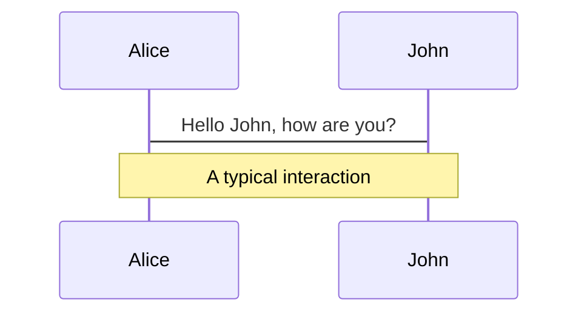
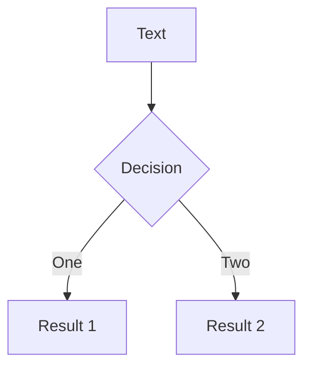

---
# try also 'default' to start simple
theme: seriph
# random image from a curated Unsplash collection by Anthony
# like them? see https://unsplash.com/collections/94734566/slidev
background: https://source.unsplash.com/collection/94734566/1920x1080
# apply any windi css classes to the current slide
class: 'text-center'
# https://sli.dev/custom/highlighters.html
highlighter: shiki
# show line numbers in code blocks
lineNumbers: true
# some information about the slides, markdown enabled
info: |
  ## Slidev Starter Template
  Presentation slides for developers.

  Learn more at [Sli.dev](https://sli.dev)
# persist drawings in exports and build
drawings:
  persist: false

aspectRatio: 16/10

---

# 毕业论文答辩

基于 CodeMirror.next 和 GraphQL 的正则表达式可视化...

|         |            |
| ------- | ---------- |
| School  | FAFU       |
| SNo.    | 3186016025 |
| Author  | 陈贵昕     |
| Teacher | 颜吉强     |

<div class="pt-12">
  <span @click="$slidev.nav.next" class="px-2 py-1 rounded cursor-pointer" hover="bg-white bg-opacity-10">
    Press Space for next page <carbon:arrow-right class="inline"/>
  </span>
</div>

<div class="abs-br m-6 flex gap-2">
  <button @click="$slidev.nav.openInEditor()" title="Open in Editor" class="text-xl icon-btn opacity-50 !border-none !hover:text-white">
    <carbon:edit />
  </button>
  <a href="https://github.com/slidevjs/slidev" target="_blank" alt="GitHub"
    class="text-xl icon-btn opacity-50 !border-none !hover:text-white">
    <carbon-logo-github />
  </a>
</div>

<!--
The last comment block of each slide will be treated as slide notes. It will be visible and editable in Presenter Mode along with the slide. [Read more in the docs](https://sli.dev/guide/syntax.html#notes)
-->

---

# TOC

目录结构

- Part One: 选题背景与意义
- Part Two: 使用到的技术栈
- Part Three: 核心实现 & 项目展示
- Part Four: 致谢

<style>
li {
  @apply text-3xl p-2;
}

h1 {
  @apply text-5xl;

  background-color: #2B90B6;
  background-image: linear-gradient(45deg, #4EC5D4 10%, #146b8c 20%);
  background-size: 100%;
  -webkit-background-clip: text;
  -moz-background-clip: text;
  -webkit-text-fill-color: transparent; 
  -moz-text-fill-color: transparent;
}
</style>

---

# 选题背景与意义

<v-click>

随着软件开发的日益专业化、规模化，各大系统内部使用的纷繁杂乱的复杂冗余的正则表达式在软件开发后期由其他开发人员人员更迭维护时造成的理解困难和障碍日益显著

</v-click>

<v-click>

- 📝 **规模化** - 软件随着生命周期的延续，逐渐庞大臃肿
- 📝 **专业化** - 制作软件所需要的专业领域知识越来越深
- 📝 **复杂化** - 修复功能时需要对具体业务有详细的了解

```js {none|6-7|8-9|all}
for(let j=1; j<results[i].length; j++){
    for(let k=0; k<results[i][j].length; k++){
        let obj = results[i][j][k];
        let lineIndex = obj.line - 1;
        let data = source02[lineIndex];
        let nameReg = /(?<=)[a-z]+[0-9]*(?=\s[0-9]{4})/g;
        let name = data.match(nameReg);
        let dateReg = /[0-9]{4}-[0-9]{2}-[0-9]{2}\s+[0-9]{2}:[0-9]{2}:[0-9]{2}/g;
        let date = data.match(dateReg);
        if(name && date){
            log.info('     '+name[0]+' '+date[0] +' ',obj.line+'行 '+obj.message);
        }
        num++;
    }
}
log.info('   检查结果','错误个数：'+num+'个');
```

</v-click>
  
<v-click>

因此，迫切需要一款能帮助开发人员快速理解和管理**正则表达式**的软件

</v-click>

<!--
You can have `style` tag in markdown to override the style for the current page.
Learn more: https://sli.dev/guide/syntax#embedded-styles
-->

<style>
h1 {
  background-color: #2B90B6;
  background-image: linear-gradient(45deg, #4EC5D4 10%, #146b8c 20%);
  background-size: 100%;
  -webkit-background-clip: text;
  -moz-background-clip: text;
  -webkit-text-fill-color: transparent; 
  -moz-text-fill-color: transparent;
}
</style>

---
layout: cover
---

# 使用到的技术栈

---
layout: cover
---

# Frontend

[前端](http://www.baidu.com/link?url=S4cWQHgCGbAoNDfyxggFzvHTmPpCZI5Y2Z0xsKX2k0Yq-Zb3jVQkY946a5gfkJhn4oEe-WaoASxOGS9hl4201Wit8IvJH4jIpvn1SdmgmjG&wd=&eqid=d7680b5f0007b02e0000000662932938)即网站前台部分，运行在 PC 端，移动端等浏览器上展现给用户浏览的网页。随着互联网技术的发展，HTML5，CSS3，前端框架的应用，跨平台响应式网页设计能够适应各种屏幕分辨率，合适的动效设计，给用户带来极高的用户体验

---

# CodeMirror.next (CodeMirror 6)

<n-card class="flex-1">
  <n-tabs type="line" animated>
    <n-tab-pane name="特性" tab="特性">
      <p>新一代的 JavaScript 代码编辑器框架</p>
      <div class="grid grid-cols-2 gap-5">
        <div>
          <div class="text-xl font-bold">Accessible</div>
          <span>避免了当前大量编辑器所面临的一些陷阱</span>
        </div>
        <div>
          <div class="text-xl font-bold">Touchscreen Support</div>
          <span>对触摸设备（移动端）的友好支持</span>
        </div>
        <div>
          <div class="text-xl font-bold">Extensible</div>
          <span>具备优秀的可扩展性，并确保插件间不会造成 race condition</span>
        </div>
        <div>
          <div class="text-xl font-bold">Modular</div>
          <span>系统的核心非常通用，甚至语法高亮显示和行号槽等基本功能也作为扩展实现，允许在需要时省略或替换它们，可以充分利用 TreeShaking 减小包体积</span>
        </div>
        <div>
          <div class="text-xl font-bold">Full Parsing</div>
          <span>CodeMirror 为编写语言集成的推荐方法包括完整的解析树，这使得代码分析更容易、更强大</span>
        </div>
        <div>
          <div class="text-xl font-bold">Fast</div>
          <span>使用了<b>虚拟滚动</b>技术，即使有大量的文本数据，也能迅速加载渲染</span>
        </div>
      </div>
    </n-tab-pane>
    <n-tab-pane name="Why not Monaco?" tab="Why not Monaco?">
      <p>Monaco Editor 是为 Visual Studio Code 提供支持的代码编辑器，运行在浏览器环境中。</p>
      <p class="text-xl">Why not Monaco?</p>
      <li>打包体积大，replit 在使用 Monaco 实现完整功能时，需要 50 MB+</li>
      <li>需要强大完整的代码编辑器功能时，Monaco 与 Visual Studio Code 高度耦合，不易于扩展</li>
      <li>Monaco 不支持触摸屏设备，即若使用 Monaco 的情况下，未来有开发移动端需求，需要更换编辑器框架</li>
      <li>尽管 CodeMiror.next 还在 beta 阶段，但一些流行的开源 web 应用已经使用，可以作为最佳实践的参考</li>
    </n-tab-pane>
    <n-tab-pane name="设计思想" tab="设计思想">
      <div style="text-align: center; font-size: 120%; font-weight: bold; font-family: sans-serif;">
        <div class="box" style="background: #c33;">DOM event</div>
        <div>↗<span style="width: 5em; display: inline-block;"></span>↘</div>
        <div>
          <div class="box" style="margin: 0 2em 0 3em; background: #55b">view</div>
          <div class="box" style="background: #77e">transaction</div>
        </div>
        <div>↖<span style="width: 5em; display: inline-block;"></span>↙</div>
        <div class="box" style="background: #446;">new state</div>
      </div>
    </n-tab-pane>
  </n-tabs>
</n-card>

<style>
.slidev-layout {
  @apply flex flex-col;
}

.box {
	color: white;
	display: inline-block;
	border-radius: 5px;
	padding: 6px 15px;
	margin: 3px 0;
}
</style>

---

# GraphQL

GraphQL 是一种针对 Graph（图状数据）进行查询特别有优势的 Query Language（查询语言），所以叫做 GraphQL

<v-click>
<div class="w-full pt-2">

</div>
</v-click>

<div class="grid grid-cols-3 gap-1">

<div>
<v-click>

- 定义数据模型

```graphql
type Project {
  name: String
  tagline: String
  contributors: [User] 
}
```

</v-click>
</div>

<div>
<v-click>

- 请求数据

```text
{
  project(name: "GraphQL") {
    tagline
  }
}
```

</v-click>
</div>

<div>
<v-click>

- 得到可预测的结果

```json
{
  "project": {
    "tagline": "APIs"
  }
}
```

</v-click>
</div>

</div>

---
layout: iframe

# the web page source
url: https://graphql.org/learn/queries/#arguments

# a custom class name to the content
class: my-cool-content-on-the-left
---

---
layout: two-cols
image: https://source.unsplash.com/collection/94734567/1920x1080
---

```json
{
  "dependencies": {
    "@apollo/client": "^3.5.10",
    "@codemirror/commands": "^0.19.8",
    "@codemirror/gutter": "^0.19.9",
    "@codemirror/rangeset": "^0.19.9",
    "@codemirror/state": "^0.19.9",
    "@codemirror/text": "^0.19.6",
    "@codemirror/view": "^0.19.48",
    "@vue/apollo-composable": "^4.0.0-alpha.16",
    "codemirror": "^5.65.2",
    "graphql": "^16.3.0",
    "graphql-tag": "^2.12.6",
    "pinia": "^2.0.14",
    "randexp": "^0.5.3",
    "regulex_common": "^0.1.1",
    "vue": "^3.2.25",
    "vue-router": "4"
  },
  "devDependencies": {
    "@codemirror/highlight": "^0.19.8",
    "@codemirror/search": "^0.19.10",
    "@vitejs/plugin-vue": "^2.2.0",
    "autoprefixer": "^10.4.4",
    "naive-ui": "^2.26.4",
    "postcss": "^8.4.12",
    "prettier": "^2.6.1",
    "tailwindcss": "^3.0.23",
    "typescript": "^4.5.4",
    "unplugin-auto-import": "^0.6.9",
    "vite": "^2.8.0",
    "vue-tsc": "^0.29.8"
  }
}
```

::right::

# Other technologies

<v-click>

## Vue

基于虚拟 DOM 的 JavaScript 运行时框架

</v-click>

<v-click>

## Apollo Client

使用客户端与 GraphQL 服务器进行通信

</v-click>

<v-click>

## Vue Apollo

对 Apollo Client 的封装，提供更容易操作的 api

</v-click>

<v-click>

## Tailwind CSS

原子化 CSS 框架

</v-click>

<v-click>

## Naive UI

组件库

</v-click>

<v-click>

autoprettier, typescript, prettier...

</v-click>

<style>
h2 {
  @apply mt-2 !important;
}

p {
  @apply mt-0.5 !important;
}

.grid {
  @apply gap-4;
}
</style>

---

<div grid="~ cols-2 gap-4">
<div>

# Bakcend

- Apollo Server
- GraphQL
- Mongoose
- dotenv
- nodemon
- prettier

</div>
<div>


</div>
</div>

---

# 演示文稿

- Vue
- Slidev
- Naive UI
- uno css
- LaTeX


<style>
ul {
  @apply grid grid-cols-3 mb-2;
}
</style>

<!--
1. slidev = slide + developer
2. slide = reveal.js 实现
3. reveal.js = html 展示器

uno css, 类似 tailwind css，原子化 CSS，比 tailwind CSS 语法更简洁
-->

---

# 核心实现

## GraphQL schema

<div class="grid grid-cols-2 gap-1">

```graphql {all|5-6|19|5-6|all}
type User {
  _id: ID!
  username: String!
  password: String!
  favorite: [Case!] # 收藏的用例列表
  create: [Case!] # 创建的用例列表
}


type Case {
  _id: ID!
  title: String!
  re: String! # regex pattern
  test: String # test
  user: User
}
```

```graphql {all|1|10|all}
type Query {
    getUser(id: ID!): User
    getCases(userId: ID): [Case!]!
    loginUser(username: String!, 
              password: String!): User
    getCase(id: ID!): Case
    # .....
}

type Mutation {
    registerUser(username: String!,
                 password: String!): User
    deleteUser(id: ID!): Boolean!

    createCase(input: CreateCaseInput,
               userId: ID!): Case
    deleteCase(id: ID!): ID
    favoriteCase(id: ID!): Boolean!
    # ......
}
```

</div>

<!--
1. 定义一个状态
2. 描述好该状态的属性（使用什么装饰器）
3. 通过 DOM event 触发一个 transaction 事务
4. 通过 **事务** 触发定义的状态
5. 将状态调用显示回到页面视图
-->

---

# 后端结构


<!--
1. 通过Apollo Server定义的Schema暴露接口
2. 通过context在上下文中注入Mongoose Model，连接到MongoDB数据库
3. 通过Resolvers实现查询操作Query和修改操作Mutation
4. 在具体的查询中通过访问Mongoose Model实现createCase、deleteCase……等操作
-->

---

# 项目展示


<v-click>
<div style="text-align: center; font-size: 120%; font-weight: bold; font-family: sans-serif;">
  <div class="box" style="background: #c33;">DOM event</div>
  <div>↗<span style="width: 5em; display: inline-block;"></span>↘</div>
  <div>
    <div class="box" style="margin: 0 2em 0 3em; background: #55b">view</div>
    <div class="box" style="background: #77e">transaction</div>
  </div>
  <div>↖<span style="width: 5em; display: inline-block;"></span>↙</div>
  <div class="box" style="background: #446;">new state</div>
</div>
</v-click>

<style>
.box {
	color: white;
	display: inline-block;
	border-radius: 5px;
	padding: 6px 15px;
	margin: 3px 0;
}
</style>

---

# 优化方案

---
layout: cover

---

# 致谢

---

# Themes

Slidev comes with powerful theming support. Themes can provide styles, layouts, components, or even configurations for tools. Switching between themes by just **one edit** in your frontmatter:

<div grid="~ cols-2 gap-2" m="-t-2">

```yaml
---
theme: default
---
```

```yaml
---
theme: seriph
---
```


</div>

Read more about [How to use a theme](https://sli.dev/themes/use.html) and
check out the [Awesome Themes Gallery](https://sli.dev/themes/gallery.html).

---

## preload: false

# Animations

Animations are powered by [@vueuse/motion](https://motion.vueuse.org/).

```html
<div
  v-motion
  :initial="{ x: -80 }"
  :enter="{ x: 0 }">
  Slidev
</div>
```

<div class="w-60 relative mt-6">
  <div class="relative w-40 h-40">
    
    
    
  </div>

  <div 
    class="text-5xl absolute top-14 left-40 text-[#2B90B6] -z-1"
    v-motion
    :initial="{ x: -80, opacity: 0}"
    :enter="{ x: 0, opacity: 1, transition: { delay: 2000, duration: 1000 } }">
    Slidev
  </div>
</div>

<!-- vue script setup scripts can be directly used in markdown, and will only affects current page -->
<script setup lang="ts">
const final = {
  x: 0,
  y: 0,
  rotate: 0,
  scale: 1,
  transition: {
    type: 'spring',
    damping: 10,
    stiffness: 20,
    mass: 2
  }
}
</script>

<div
  v-motion
  :initial="{ x:35, y: 40, opacity: 0}"
  :enter="{ y: 0, opacity: 1, transition: { delay: 3500 } }">

[Learn More](https://sli.dev/guide/animations.html#motion)

</div>

---

# LaTeX

LaTeX is supported out-of-box powered by [KaTeX](https://katex.org/).

<br>

Inline $\sqrt{3x-1}+(1+x)^2$

Block

$$
\begin{array}{c}

\nabla \times \vec{\mathbf{B}} -\, \frac1c\, \frac{\partial\vec{\mathbf{E}}}{\partial t} &
= \frac{4\pi}{c}\vec{\mathbf{j}}    \nabla \cdot \vec{\mathbf{E}} & = 4 \pi \rho \\

\nabla \times \vec{\mathbf{E}}\, +\, \frac1c\, \frac{\partial\vec{\mathbf{B}}}{\partial t} & = \vec{\mathbf{0}} \\

\nabla \cdot \vec{\mathbf{B}} & = 0

\end{array}
$$

<br>

[Learn more](https://sli.dev/guide/syntax#latex)

---

# Diagrams

You can create diagrams / graphs from textual descriptions, directly in your Markdown.

<div class="grid grid-cols-2 gap-10 pt-4 -mb-6">





</div>

[Learn More](https://sli.dev/guide/syntax.html#diagrams)

---

layout: center
class: text-center

---

# Learn More

[Documentations](https://sli.dev) · [GitHub](https://github.com/slidevjs/slidev) · [Showcases](https://sli.dev/showcases.html)
